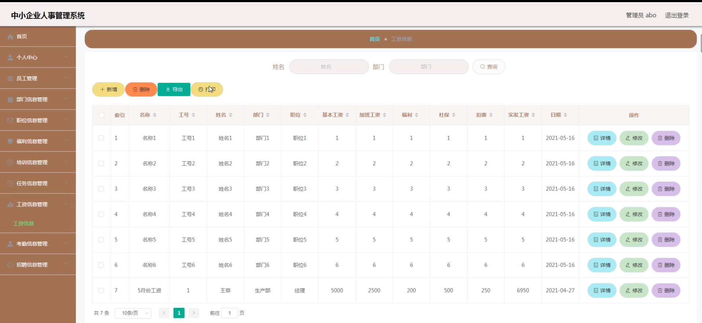

# 基于springboot的中小企业人事管理系统

#### 介绍

基于Springboot的中小企业人事管理系统，旨在为企业提供高效、便捷的员工管理和人事处理平台。系统通过现代化的信息管理手段，实现了对员工信息、部门信息、职位信息、福利信息、培训信息、任务信息、工资信息和考勤信息的全面管理。系统设计了两种角色：管理员和员工，每个角色对应不同的功能模块，满足企业人事管理的需求。

#### 技术栈

后端技术栈：Springboot+Mysql+Maven

前端技术栈：Vue+Html+Css+Javascript+ElementUI

开发工具：Idea+Vscode+Navicate

#### 系统功能介绍

管理员角色功能模块  
个人中心：管理员可以管理个人信息，包括修改密码、更新联系方式等。  
员工管理：管理员可以添加、修改、删除和查看员工信息，管理员工的基本资料和工作记录。  
部门信息管理：管理员可以管理公司的部门信息，包括添加、修改、删除和查看部门详情。  
职位信息管理：管理员可以管理公司的职位信息，包括添加、修改、删除和查看职位详情。  
福利信息管理：管理员可以管理员工的福利信息，包括添加、修改、删除和查看福利内容。  
培训信息管理：管理员可以管理员工的培训信息，包括安排培训计划、记录培训情况等。  
任务信息管理：管理员可以分配和管理员工的任务，包括添加、修改、删除和查看任务详情。  
工资信息管理：管理员可以管理员工的工资信息，包括计算工资、发放工资、记录工资发放情况等。  
考勤信息管理：管理员可以管理员工的考勤信息，包括记录考勤情况、查看考勤报表等。  
招聘信息管理：管理员可以发布和管理招聘信息，包括添加、修改、删除和查看招聘职位和应聘者信息。  

员工角色功能模块  
个人中心：员工可以管理个人信息，包括修改密码、更新联系方式等。  
部门信息管理：员工可以查看公司部门的详细信息，了解部门职责和成员。  
福利信息管理：员工可以查看自己的福利信息，了解福利内容和享受情况。  
培训信息管理：员工可以查看和参与公司的培训计划，了解培训内容和安排。  
任务信息管理：员工可以查看和管理自己的任务，了解任务详情和完成情况。  
工资信息管理：员工可以查看自己的工资信息，了解工资构成和发放情况。  
考勤信息管理：员工可以查看自己的考勤记录，了解出勤情况和考勤统计。  

#### 系统作用

该系统的主要作用包括：

提升人事管理效率：通过信息化手段，实现员工信息、考勤信息、工资信息等的全面管理，减少人工操作，提高人事管理效率。  
优化员工资源配置：通过员工管理、部门信息管理和职位信息管理功能，合理配置和管理员工资源，优化企业的人力资源结构。  
提供全面的员工服务：通过福利信息管理、培训信息管理、任务信息管理和工资信息管理功能，为员工提供全面的服务，提升员工满意度和工作积极性。  
支持企业招聘和培训：通过招聘信息管理和培训信息管理功能，支持企业的人才招聘和员工培训，提升企业的人才储备和员工技能。  
提高员工自助管理能力：通过员工角色的各项功能模块，提升员工的自助管理能力，使员工能够便捷地管理和查看个人信息、福利、工资等。  

#### 系统功能截图

代码结构

数据库表

登录

员工管理

部门信息管理

福利相信管理

任务信息管理

工资信息管理

招聘信息管理

员工端部门信息

考勤信息管理

#### 总结

基于Springboot的中小企业人事管理系统通过科学的角色划分和详细的功能模块设计，实现了企业人事管理的高效化、智能化和信息化。系统为管理员和员工提供了便捷的在线服务，优化了员工信息管理、考勤记录、工资发放、培训计划和福利管理等流程，提升了人事管理效率和员工体验。通过全面的功能支持，系统不仅提升了企业的人力资源管理水平，还增强了员工的满意度和工作积极性，助力企业在激烈的市场竞争中保持良好的发展势头。

#### 使用说明

创建数据库，执行数据库脚本 修改jdbc数据库连接参数 下载安装maven依赖jar 启动idea中的springboot项目

后台地址：http://localhost:8080/springbootq731f/admin/dist/index.html

管理员  abo 密码 abo